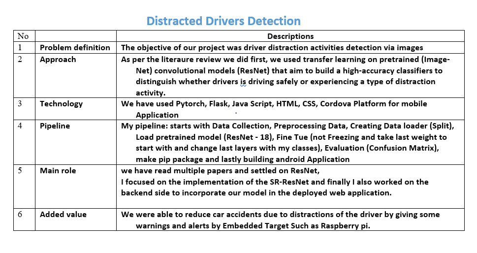

# Computer-Vision-Distracted-Drivers-Detection
This project focuses on driver distraction activities detection via images, which is useful for vehicle accident precaution. We aim to build a high-accuracy classifiers to distinguish whether drivers is driving safely or experiencing a type of distraction activity.



<ul>
  <li> Pip Package : https://pypi.org/project/Distracted-Driver-Detection/</li>
  <li> WebSite     : https://distracteddriver-detection-app.herokuapp.com/</li>
  <li> Android-app : [app-debug.zip](https://github.com/MohamedSebaie/Distracted-Driver-Detection-Project-TechnoColabs/files/8009103/app-debug.zip)
</li>
  
</ul>  

https://user-images.githubusercontent.com/45875057/152063140-60343910-ab51-4a8a-b42a-a2f7a50f0320.mp4


https://user-images.githubusercontent.com/45875057/152063153-638f60bf-edbc-45a5-858a-c4306da9cb56.mp4


## Project Overview

According to the CDC motor vehicle safety division, one in five car
accidents is caused by a distracted driver. Sadly, this translates to 425,000
people injured and 3,000 people killed by distracted driving every year.

In this project, I have created and refined machine learning models to detect
what the driver is doing in a car given driver images. This is done by
predicting the likelihood of what the driver is doing in each picture. 

## Problem Statement

Given a dataset of images, an algorithm needs to classify each driver's behaviour and determine if they are
driving attentively, wearing their seatbelt, or taking a selfie with their friends in
the backseat etc ? This can then be used to automatically detect drivers
engaging in distracted behaviours from dashboard cameras.

Following are needed tasks for the development of the algorithm:

1. Download and preprocess the driver images

2. Build and train the model to classify the driver images

3. Test the model and improve the model using different techniques.

## Data Exploration

The provided data set has driver images, each taken in a car with a driver
doing something in the car (texting, eating, talking on the phone, makeup,
reaching behind, etc). This dataset is obtained from Kaggle(State Farm
Distracted Driver Detection competition).

Following are the file descriptions and URL’s from which the data can be
obtained :
* imgs.zip - zipped folder of all (train/test) images
* sample_submission.csv - a sample submission file in the correct format
* driver_imgs_list.csv - a list of training images, their subject (driver) id, and class id

The 10 classes to predict are:

* c0: safe driving

* c1: texting - right

* c2: talking on the phone - right

* c3: texting - left

* c4: talking on the phone - left

* c5: operating the radio

* c6: drinking

* c7: reaching behind

* c8: hair and makeup

* c9: talking to passenger

There are 102150 total images. Of these 17939 are training images,4485
are validation images and 79726 are training images. All the training,
validation images belong to the 10 categories shown above.
The images are coloured and have 640 x 480 pixels


### Data Preprocessing
* Initially the images are divided into training and validation sets.
* The images are resized to a square images i.e. 224 x 224 pixels.
* All three channels were used during training process as these are color
images.
* The images are normalised by dividing every pixel in every image by 255.
* To ensure the mean is zero a value of 0.5 is subtracted.


 

<h1 color="green"><b>Distracted Driver Detection Package</b></h1>

---


<h1 color="green"><b>Instructions to Install our Distracted Driver Detection Package</b></h1>


1. Install:

```python
pip install Distracted-Driver-Detection
```

2. Download the Finetunned Model Weights

```python
import gdown
PytorchURL      = 'https://drive.google.com/uc?id=1P9r7pCc-5eTmW4krT4GZ1F6w_miTtxJA'
TfLiteURL       = 'https://drive.google.com/uc?id=1WbZD6PMETHIH6oMj0bzyG3BoDUlyO2Ll'
TestImagesURL   = 'https://drive.google.com/uc?id=1sodvME9eXHuZ-4qjTxmxsLsfFsg99KpK'
PytorchModel    = 'model_ft.pth'
TfLiteModel     = 'model.tflite'
TestImages      = 'test_imgsN.zip'
gdown.download(PytorchURL, PytorchModel, quiet=False)
gdown.download(TfLiteURL, TfLiteModel, quiet=False)
gdown.download(TestImagesURL, TestImages, quiet=False)
```
3. Import the DistractedDriverDetection_Utils from distracted_driver_detection :

```python
from distracted_driver_detection import DistractedDriverDetection_Utils
import matplotlib.pyplot as plt
import matplotlib.image as mpimg
```

4. Detect The Distraction Class for the Driver Using Pytorch Weights:

```python
# Run the Below Function by Input your image Path to get the outPut class and probability for the driver distraction class then show it
class_,pro = DistractedDriverDetection_Utils.PredictClass(imgPath)
print(class_,pro)
plt.imshow(mpimg.imread(imgPath));

# Plot Batch of Test Images from directory with Detection
DistractedDriverDetection_Utils.predMulti_images(test_img_dir,nImages=4)
```

5. Detect The Distraction Class for the Driver Using Tesorflow Lite Model:

```python
# Run the Below Function by Input your image Path to get the outPut class and probability for the driver distraction class then show it
class_,pro = DistractedDriverDetection_Utils.tfliteModel_Prediction(imgPath)
print(class_,pro)
plt.imshow(mpimg.imread(imgPath));

# Plot Batch of Test Images from directory with Detection
DistractedDriverDetection_Utils.tfliteModel_Plot(test_img_dir,nImages=4)
```


## Project Team Members

1. Abdullah Abdelhakeem
2. Mohamed Sebaie
3. Mahmoud Salama
